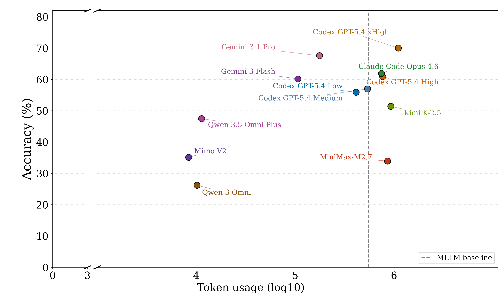
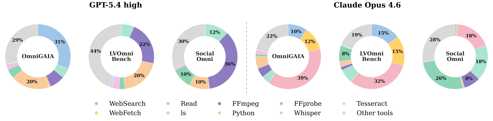
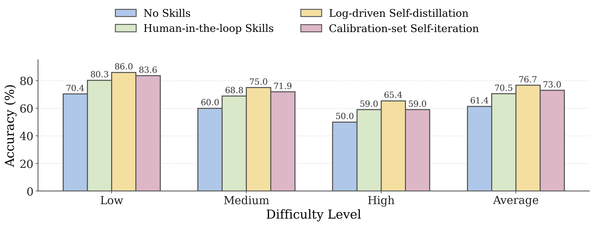

# Sandboxed Coding Agents are Competitive Omni-modal Task Solvers

[arXiv:2606.00579](https://arxiv.org/abs/2606.00579)

Due to review-related constraints, code and dataset are currently under review and will be made available soon.

## Overview

This paper studies whether sandboxed coding agents can solve omni-modal tasks without native video or audio perception. The core finding is that text+image coding agents can handle many video/audio problems by staging files in a terminal workspace, then using tools such as `ffmpeg`, `ffprobe`, ASR/OCR, Python scripts, and search to extract compact evidence from raw media.

## Method

- **Sandboxed omni-modal solving:** raw video, audio, images, and documents remain as files in a workspace; the agent actively decomposes them into transcripts, sampled frames, metadata, OCR text, timestamps, and intermediate artifacts.
- **Code-X:** an open-source-oriented training recipe for terminal omni-modal agents, using SFT followed by GSPO-based RL with a process-aware verifiable reward.
- **OmniCoding dataset:** 6,035 trajectory examples spanning video, audio, image, and cross-modal tasks, split into 4,042 SFT and 1,993 RL examples.
- **Skill injection:** human-written skills, calibration-set self-iteration, and log-driven self-distillation are evaluated as inference-time procedural knowledge.

## Benchmark and Results

Evaluations cover OmniGAIA, SocialOmni, LVOmniBench, VideoZeroBench, and the proposed **TerminalBench-O**, a 50-task process-level benchmark for real-world omni-modal processing.

Key results:

- On OmniGAIA, GPT-5.4 xHigh under Codex reaches **75.0%**, outperforming Gemini 3.1 Pro (**66.1%**).
- On VideoZeroBench, the best coding agent reaches **27.6%**, above the strongest native omni baseline in the study (**17.8%**).
- Code-X improves open-source Qwen baselines; the 27B setting reaches **43.3%** on OmniGAIA and **60.0%** on LVOmniBench.
- Log-driven skill self-distillation improves GPT-5.4 high on OmniGAIA from **61.4%** to **76.7%** average accuracy.
- TerminalBench-O remains difficult: the best evaluated GPT-5.5 Codex settings reach **24%** pass rate.

## Figures



Sandboxed coding agents are competitive with native omni-modal models while selectively consuming far less media context.



Agents rely on staged tool pipelines across benchmarks, with frequent use of search, media extraction, transcription, OCR, and Python.



Reusable skills and log-driven self-distillation substantially improve OmniGAIA accuracy.

## Citation

```bibtex
@misc{chen2026sandboxedcodingagentscompetitive,
      eprint={2606.00579},
      archivePrefix={arXiv},
      primaryClass={cs.CL},
      url={https://arxiv.org/abs/2606.00579},
}
```
